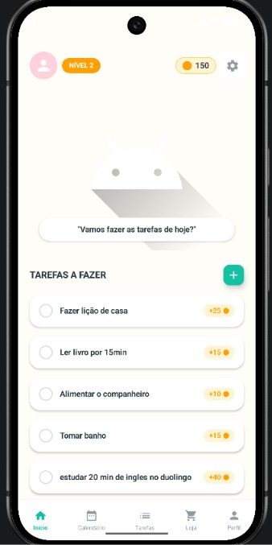
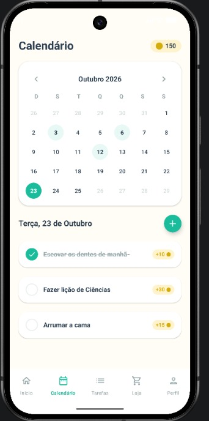
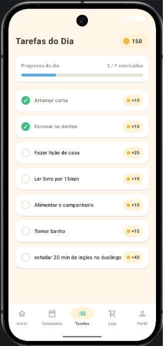
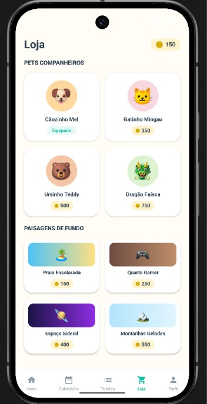
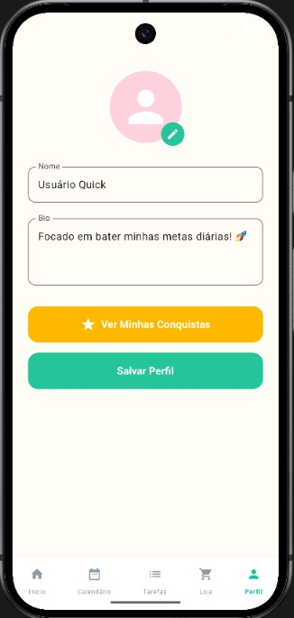
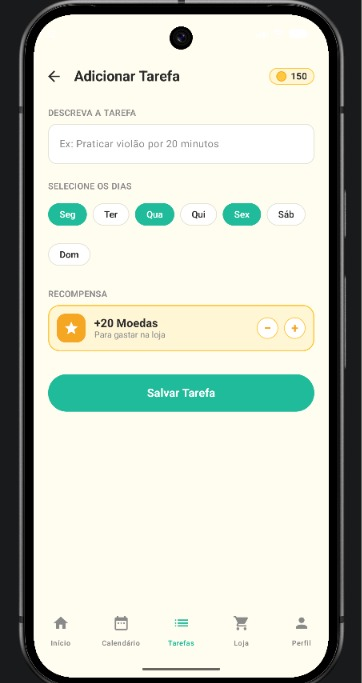

# Quick!

> Aplicativo desenvolvido em Kotlin. O aplicativo Quick! tem o intuito de incentivar que os usuários passem menos tempo
> no celular, e mais tempo se desenvolvendo, tal como estudando e/ou praticando execícios físicos.


## 📋 Sumário

- [Sobre](#-sobre)
- [Funcionalidades](#-funcionalidades)
- [Tecnologias](#-tecnologias)
- [Pré-requisitos](#-pré-requisitos)
- [Como executar](#-como-executar)
- [Estrutura do projeto](#-estrutura-do-projeto)
- [Equipe](#-equipe)

## 📖 Sobre

O aplicativo Quick! tem o objetivo que as pessoas passem menos tempo conectadas e pratiquem mais atividades que antes
costumavam fazer, dessa maneira pensamos que desenvolvendo um aplicativo móvel seria um bom incentivo, pois ao realizar
as tarefas serão obtidas moedas que servirão para personalização do pet e seus cenários. Projeto criado exclusivamente para 
a matéria de Desenvolvimento de Aplicativos Móveis no intuito de ser inovador no que se propoẽ

## 🛸 Documentação do processo e das decisões
1- Como estava o projeto no Trabalho 1, e o que mudou para chegar até aqui?
adicionamos mais 4 telas, por exemplo a tela de adicionar tarefas interage com a tela inicial e tarefas do dia, nossa navegationbar está 100% funcional com seus itens.
2 - Por que essas telas novas — o que cada uma faz e por que o trio escolheu elas?
tela de loja -> o player poder personalizar o pet, ideias iniciais
tela de perfil -> visualização da aba conquistas, telas base para um app que possui cadastro
tela de conquistas -> mostra conquistas (ex: 5 dias em sequencia realizando todas as tarefas), inspiramos no duolingo e achamos uma ideia interessante pro quick!
tela de adicionar tarefas -> adiciona uma tarefa na lista a ser realizado, ideias iniciais  
3 - Que decisão de configuração/organização do código o trio tomou, e por quê? (ex: como
organizaram as rotas, onde ficou a lista, como decidiram estruturar o NavHost)
Gestão do Estado: Uso do TaskRepository (StateFlow) como fonte única de dados para sincronizar o estado entre PetHome e TarefasDoDiaScreen.
Arquitetura de Navegação: Uso de NavHost local para o fluxo da AddTaskScreen e Intents para navegação entre as diferentes Activities da BottomBar.
Modularização e Clean Code: Componentização com passagem de callbacks (lambdas) para manter o código testável e funcional no Preview do Compose.
4 - Qual foi a complexidade extra que o trio colocou na tela de Detalhes (pedida na seção 3.2), e por
que escolheram justamente essa?
Na lista de tarefas, assim que a tarefa é marcada como concluída o texto fica grifado e cinza, junto da bolinha ao lado que fica na cor verde e um ✓ ao lado.
5 - Algum integrante teve dificuldade em algum ponto? Como resolveram?
Tivemos diversas dificuldade, mas a pior de todas seria o tempo e que podemos apenas realizar na sala de aula, onde há o android que utilizamos, que é um tempo bem curto pra complexidade do que é pedido.

## ✨ Funcionalidades

- [x] Tela de perfil
- [x] Tela de conquistas
- [x] Tela de listas de tarefas a fazer e concluídas
- [x] Tela de Loja
- [x] Tela de calendário
- [x] Tela principal com pet
- [x] Tela de adicionar tarefas

## 🛠 Tecnologias

- [Kotlin](https://kotlinlang.org/)
- [Gradle (Kotlin DSL)](https://gradle.org/)
- [Android Studio](https://developer.android.com/studio)

## ✅ Pré-requisitos

- [Android Studio](https://developer.android.com/studio) instalado
- JDK compatível com a versão do Gradle do projeto
- Um emulador Android configurado ou um celular com depuração USB ativada

## 🚀 Como executar

```bash
# Clone o repositório
git clone https://github.com/SophiLombardi/quick-.git

# Entre na pasta
cd quick-
```

1. Abra o projeto no **Android Studio** (`File > Open` e selecione a pasta do projeto).
2. Aguarde o Gradle sincronizar as dependências.
3. Escolha um emulador ou dispositivo e clique em **Run ▶**.

Também é possível compilar pelo terminal:

```bash
# Linux / macOS
./gradlew assembleDebug

# Windows
gradlew.bat assembleDebug
```

## 📁 Estrutura do projeto

```
quick-/
├── app/                    # Código-fonte do aplicativo
├── gradle/                 # Configurações do Gradle wrapper
├── build.gradle.kts        # Configuração de build do projeto
├── settings.gradle.kts     # Módulos do projeto
├── gradle.properties       # Propriedades do Gradle
├── gradlew / gradlew.bat   # Gradle wrapper (Linux/macOS e Windows)
└── README.md
```

## 📸 Imagens









## 👥 Equipe

- [@SophiLombardi](https://github.com/SophiLombardi)
- [@VictEES](https://github.com/VictEES)
- [@Rafazola](https://github.com/Rafazola)
